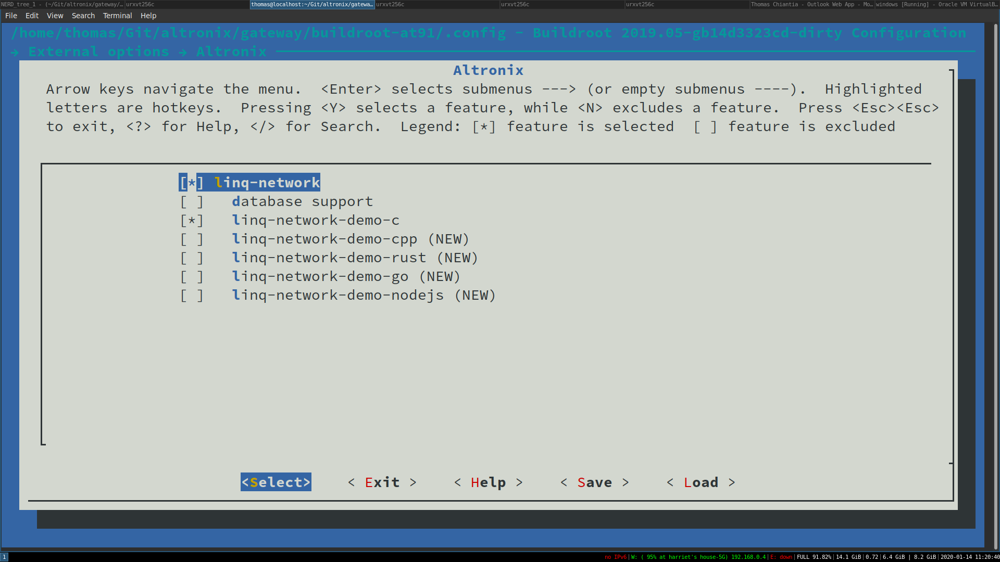
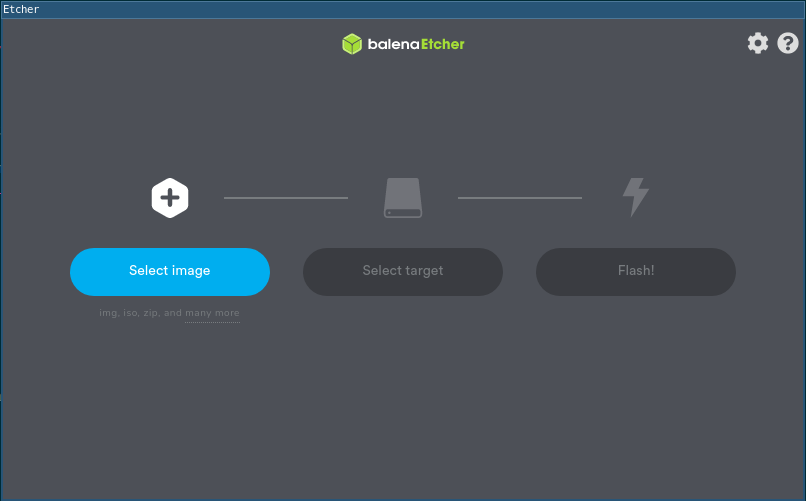
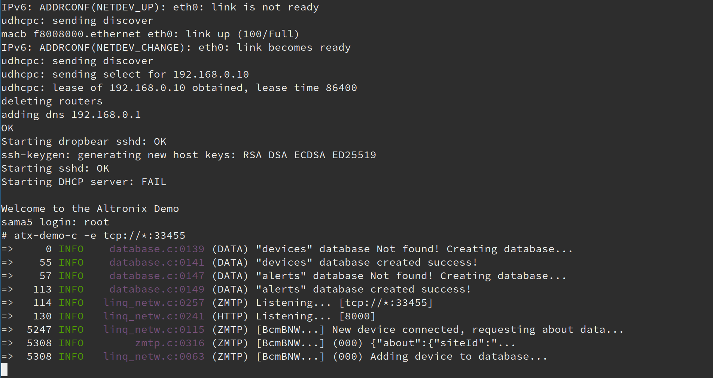

.. include:: ../roles.rst

.. _ref-getting_started_buildroot:

Buildroot Enviorment
====================

Buildroot is used to build Embedded Linux Systems that can be cross compiled for unique hardware targets such as the Altronix LinQ Master module or the Microchip Sama5D27 SOM1 Module. Buildroot has it's own user manual and the Altronix LinQ Network User Guide is only meant as a companion guide. Users should read the Buildroot User Manual in its entirety, paying closer attention to the Section 8.5 - Building Out of tree :blue:`[1]`, Section 8.6 - Enviorment Variables :blue:`[2]`, Section 8.12 - Advanced Usage :blue:`[3]`, Section 9 - Project specific customization :blue:`[4]`, and Section III - developer guide :blue:`[5]`.

.. rst-class:: font-small
.. container::
   
   1. `Section 8.5 - Building Out of Tree <https://buildroot.org/downloads/manual/manual.html#_building_out_of_tree>`_
   
   2. `Section 8.6 - Enviorment Variables <https://buildroot.org/downloads/manual/manual.html#env-vars>`_
   
   3. `Section 8.12 - Advanced Usage <https://buildroot.org/downloads/manual/manual.html#_advanced_usage>`_
   
   4. `Section 8.6 - Project Specific Customization <https://buildroot.org/downloads/manual/manual.html#customize>`_
   
   5. `Section III - Developer Guide <https://buildroot.org/downloads/manual/manual.html#_developer_guide>`_

   6. `Buildroot User Manual PDF <https://buildroot.org/downloads/manual/manual.pdf>`_

Required Packages
-----------------

   *If you find any packages are missing, please add them to the list by submitting a PR.*

1. which

2. sed

3. make (version 3.81 or any later)

4. binutils

5. build-essential (only for Debian based systems)

6. gcc (version 4.8 or any later)

7. g++ (version 4.8 or any later)

8. bash

9. patch

10. gzip

11. bzip2

12. perl (version 5.8.7 or any later)

13. tar

14. cpio

15. unzip

16. rsync

17. file (must be in /usr/bin/file)

18. bc 

19. python (version 2.7 or any later) 

20. `Etcher <https://www.balena.io/etcher>`_

Optional Packages
------------------

1. asciidoc, version 8.6.3 or higher

2. w3m

3. python with the argparse module (automatically present in 2.7+ and 3.2+)

4. dblatex (required for the pdf manual only) 

5. graphviz to use graph-depends and <pkg>-graph-depends

6. python-matplotlib to use graph-build 

Altronix Buildroot Packages
---------------------------

Buildroot offers the BR2_EXTERNAL enviorment variable as a convenient option to store packages outside of the mainline buildroot repository.  Altronix uses this enviorment variable to extend buildroot with Altronix specific packages such as the LinQ Network library and application demos.  To get started with buildroot, clone the altronix buildroot repository and the buildroot-external-altronix submodule into your development workspace.

.. code-block:: shell

   git clone https://bitbucket.org/Altronix/buildroot-at91
   cd buildroot-at91
   git submodule update --init

You are now ready to configure and compile your embedded linux system.

Altronix Demo Configuration
---------------------------

From inside your buildroot-at91 workspace you can observe the following directory structure:

::

   buildroot-at91/
   |-- arch/
   |-- board/
   |-- boot/
   |-- configs/
   |-- dl/
   |-- docs/
   |-- package/ 
   |   |-- ...                                          <-- mainline buildroot packages
   |-- external/
   |   |-- buildroot-external-altronix/
   |   |   |-- board/
   |   |   |-- configs/
   |   |   |   |-- sama5d27_som1_ek_headless_defconfig  <-- Microchip Demo Config
   |   |   |   |-- sama5d27_som1_ek_altronix_defconfig  <-- Altronix Demo Config
   |   |   |   |-- ...
   |   |   |-- package/
   |   |   |   |-- ...                                  <-- Extra Microchip + Altronix Packages

In order to create your own Embedded Linux System you should start from a configuration that is most similar to your target hardware and software requirments.  To create. To explore the Altronix Demo Configuration, run the command from buildroot-at91 root directory:

.. code-block:: shell

   make menuconfig

You should see the following menu.

.. image:: ../_static/img/makemenu-config.jpg

From the initial menuconfig view, navigate to External -> Altronix to view the Altronix specific package options.

Creating A Custom DefConfig
---------------------------

To create your own package configuration and save the configuration into the Altronix config folder. Run make menuconfig command. Make your changes and then select save.

.. note:: This will save your configuration to buildroot-at91/.config and therefore will not overwrite the configuration you started from.

After you have made all the changes to your Embedded Linux System, run the following command to save your new configuration.

.. code-block:: shell

   make savedefconfig BR2_DEFCONFIG=./external/buildroot-external-altronix/configs/sama5d27_som1_ek_my_new_altronix_defconfig

Flashing SD Card onto target hardware
-------------------------------------

After you have finished customizing your Embedded Linux System you can build the system by running the command make. In summary:

.. code-block:: shell
   
   make sama5d27_som1_ek_altronix_defconfig
   make menuconfig

   # ... Customize your build

   make savedefconfig BR2_DEFCONFIG external/buildroot-external-altronix/configs/sama5d27_som1_ek_my_new_altronix_defconfig
   make

.. attention:: Note that making the Embedded Linux System can take between 45 minutes to 2 hours depending on your host hardware situation.

When your root file system is finially ready you will have a SD card image located in: 

   output/images/sdcard.img

1. Plug an SD card into your computer and open up the Etcher program.

2. Navigate to your new sdcard.img file and select flash.

.. attention:: You may need administrator or root access in order for Etech to access your SD card

Running Demo
------------

After you flash your target hardware with your configured Embedded Linux system you can log into the device and run the demo.

.. note:: use dmesg to find the usb port your target hardware is using

   .. code-block:: shell

      dmesg

1. Connect to your target hardware using a terminal emulator (IE:)

.. code-block:: shell

   sudo picocom --baud 115200 --databits 8 --parity none --stop 1 --flow none /dev/ttyACM1

2. After logging into the terminal run the demo application. You should see the following output.

Your target hardware is now listening for incoming devices...

.. note:: If SQLITE is enabled then you can log into the HTTP server

Development Workflow
--------------------

Buildroot is designed to build Embedded Linux Systems by default.  Package dependencies are downloaded during the build process.  When you run `make clean` the packages you have downloaded will be downloaded again. This is not convenient when you are working on developing your library or application.  In order to work on your source  code with in Buildroot, Buildroot provides a special `make` variable called ${PROJECT_NAME}_OVERRIDE_SRCDIR and expects to find these override locations located in a file called `local.mk` located at the root of your buildroot repository.

For example, if you would like to make some changes to the source code for linq-network-buildroot-demo-c project, you would perform the following steps.

1. Inside local.mk.

   .. code-block:: make

      LINQ_NETWORK_DEMO_C_OVERRIDE_SRCDIR = /path/to/my/workspace/project

2. Edit project source files.

3. Rebuild your project.

   .. code-block:: shell

      make {project-name}-rebuild

   .. attention:: Buildroot does not track if any dependencies must need to be rebuilt after you make your changes. When in doubt, rebuild any related projects to your changes as well.

4. Rebuild your Embedded Linux System

   .. code-block:: shell

      make

Adding Custom Package
---------------------

To add a C/C++ package to your Buildroot system, first you must create a Config.in and a {project_name}.mk file located in the buildroot-external-altronix package folder.

::

   buildroot-at91\
     |-- external\
     |   |-- external-buildroot-altronix\
     |   |   |-- Config.in              <-- Root buildroot-external-altronix Config file
     |   |   |-- package\
     |   |   |   |-- my-project\
     |   |   |   |   |-- Config.in      <-- Your project config file
     |   |   |   |   |-- my-project.mk  <-- Your project make file

To add your project to Buildroot menu configuration, add your project to buildroot-external-altronix config file.

.. code-block:: text

   menu "Altronix"
   	source "$BR2_EXTERNAL_ATX_PATH/package/linq-network/Config.in"
   	source "$BR2_EXTERNAL_ATX_PATH/package/linq-network-demo-c/Config.in"
   	source "$BR2_EXTERNAL_ATX_PATH/package/linq-network-demo-cpp/Config.in"
   	source "$BR2_EXTERNAL_ATX_PATH/package/linq-network-demo-rust/Config.in"
   	source "$BR2_EXTERNAL_ATX_PATH/package/linq-network-demo-go/Config.in"
   	source "$BR2_EXTERNAL_ATX_PATH/package/linq-network-demo-nodejs/Config.in"

        # Your project here
   	source "$BR2_EXTERNAL_ATX_PATH/package/my-project/Config.in"
   endmenu

Config.in
~~~~~~~~~

The Config.in file is used to inform Buildroot about your project dependencies and configuration options and also provides help information about your package.

If your project has any dependencies or configuration options, refer to `Buildroot User Guide Section 17 <https://buildroot.org/downloads/manual/manual.html#adding-packages>`_

.. code-block:: text

   config BR2_PACKAGE_MY_PROJECT
   bool "my-project"
   help
     This is a minimal package.

     https://bitbucket.org/Altronix/my-project

.. attention:: When adding your package to buildroot, you are creating an Embedded Linux Distribution, and your installation files are installed into system directories. To make sure you install your packages efficiently, you should link your dependencies using shared libraries. 

Makefile for a C/C++ package
~~~~~~~~~~~~~~~~~~~~~~~~~~~~

Buildroot hooks into building your C/C++ project by invoking your C/C++ package build system such as Autotools or CMake. Refer to `Buildroot User Guide Section 17.7 <https://buildroot.org/downloads/manual/manual.html#_infrastructure_for_cmake_based_packages>`_ for how to add your CMake package to your Embedded Linux System. 

Refer to the linq-network-demo-c package for an example of how to add your CMake package to your Embedded Linux System.

Makefile for a Rust Package
~~~~~~~~~~~~~~~~~~~~~~~~~~~

Buildroot hooks into building your Rust project by invoking Cargo from the buildroot make system. Refer to `Buildroot User Guide Section 17.16 <https://buildroot.org/downloads/manual/manual.html#_integration_of_cargo_based_packages>`_ for how to add your rust package to your Embedded Linux System.  

Refer to the linq-network-demo-rust package for an example of how to add your rust package to your Embedded Linux System.

Makefile for a Go Package
~~~~~~~~~~~~~~~~~~~~~~~~~

Buildroot hooks into building your Go project by invoking golang-package from the buildroot make system. Refer to `Buildroot User Guide Section 17.17 <https://buildroot.org/downloads/manual/manual.html#_infrastructure_for_go_based_packages>`_ for how to add your go package to your Embedded Linux System.  

Refer to the linq-network-demo-go package for an example of how to add your go package to your Embedded Linux System.

Other
~~~~~

Interpretted languages such as NodeJS and python do not need to be compiled and therefore do not have a make file requirment to add to your Embedded Linux System.
