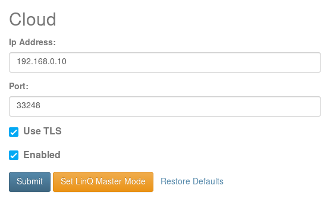
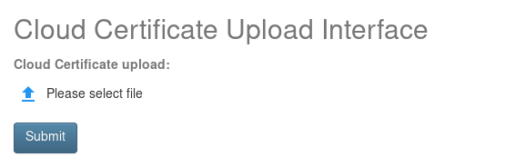

Setting Up Network Devices
==========================

The following settings describe how to connect your Altronix LinQ enabled product to the Altronix Dashboard Software.

.. _ref-getting_started_device_setup_enable_cloud:

Enable Cloud
------------

1. Connect your Altronix LinQ enabled product to your Local Area Network (LAN).

2. Open a browser and navigate to the Altronix LinQ enabled product Web Page by entering the IP address of your Altronix LinQ enabled product into the URL bar.

3. Log into the device by entering the user name and password.

4. Navigate to Settings -> Cloud from the side navigation panel.

5. Click on the TCP / IP tab from the Cloud configuration view.

6. Enter the IP address of the machine running Altronix LinQ Dashboard Software into the IP field.

   1. Example: 192.168.0.34

7. Enter the Port number that is configured into the Altronix LinQ Dashboard software. 
   
   1. Default: TODO

.. attention:: If you are using TLS to protect the connection between the device and host. You must select "Enable TLS" on the device cloud configuration form.

.. _ref-getting_started_device_setup_upload_certificate:

Upload Certificate (Required for TLS Only)
------------------------------------------

1. From the Settings -> Cloud form, navigate to the "Certificate" tab.

2. Click on the "Upload" icon and navigate to the Public Key of the Certificate installed on the Altronix Dashboard Software.

   .. warning:: The Public Key must be in plain text PEM format!
